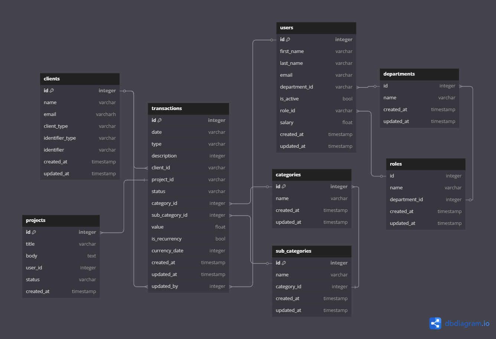

[[EN-US Documentation ↓]]()

# qontrola: Sistema para Gestão de Projetos e Finanças Corporativas


**qontrola** é um sistema ERP (Enterprise Resource Planning) desenvolvido como plataforma, voltado para empresas prestadoras de serviços que atuam com base em projetos. A plataforma permite uma gestão financeira precisa tanto em nível **micro** (projetos individuais) quanto em nível **macro** (visão consolidada da empresa), com foco em eficiência, segurança e escalabilidade.

## Conteúdos

- [Sobre o Projeto](#sobre-o-projeto)
- [Principais Etapas do Projeto](#principais-etapas-do-projeto)
- [Funcionalidades](#funcionalidades)
  - [Gestão de Projetos](#-gestão-de-projetos)
  - [Controle Financeiro](#-controle-financeiro)
  - [Relatórios e Indicadores](#-relatórios-e-indicadores)
  - [Controle de Acesso](#-controle-de-acesso)
  - [Gestão de Funcionários](#gestão-de-funcionários)
- [Modelagem de Dados](#modelagem-de-dados)
- [Estrutura do Projeto](#estrutura-do-projeto)
- [Tecnologias Utilizadas](#tecnologias-utilizadas)
- [Como Executar o Projeto](#como-executar-o-projeto)

## Sobre o Projeto

[Topo ⤴︎](#conteúdos)

## Sobre o Projeto

[Topo ⤴︎](#conteúdos)

Gerenciar projetos é desafiador. Mas gerenciar as **finanças de cada projeto com clareza e controle real** é ainda mais difícil — especialmente para empresas que vivem de entregar serviço sob demanda.

Consultorias, agências, escritórios de engenharia, software houses e tantas outras enfrentam diariamente o mesmo problema:

> "Sabemos *o que* está sendo entregue, mas nem sempre sabemos *quanto* está realmente custando."

A maioria dos ERPs do mercado trata os projetos como um item qualquer na contabilidade. Eles **não foram feitos para empresas que vivem de projetos**. E é aí que a **qontrola** entra em cena.

### A qontrola nasce para resolver essa dor com uma abordagem centrada em:

- **Microgestão:** controle financeiro preciso e individualizado por projeto, permitindo que cada centavo gasto ou faturado seja acompanhado em tempo real.
- **Macrovisão:** consolidação financeira de todos os projetos em uma visão estratégica da empresa, com indicadores (KPIs) que ajudam na tomada de decisões.
- **Experiência do usuário:** uma plataforma amigável, com navegação intuitiva, feita para pessoas que não são especialistas em finanças ou tecnologia.

---

**qontrola não é apenas mais um ERP** — é a ferramenta que entende como funciona o seu negócio,  
e foi construída para te dar **autonomia, clareza e crescimento com base em dados**.


### ⚖️ Antes e Depois com qontrola

| **Antes**                                | **Depois com qontrola**                                                             |
|------------------------------------------|--------------------------------------------------------------------------------------|
| Planilhas soltas e versões perdidas      | Todos os dados integrados em um único sistema com acesso centralizado e seguro     |
| Projetos sem controle de custo           | Cada projeto com visão financeira própria, com orçamentos, receitas e despesas      |
| Dificuldade em gerar relatórios          | Dashboards com KPIs e relatórios em tempo real por projeto e visão consolidada      |
| Falta de visibilidade sobre rentabilidade| Visão estratégica completa a partir dos dados reais dos projetos                    |
| Dependência do time financeiro/contador  | Equipes autônomas com interface simples e permissões por usuário                    |


## Funcionalidades

### ✅ Gestão de Projetos
- Cadastro de projetos com informações financeiras e operacionais.
- Acompanhamento do orçamento previsto vs. realizado.
- Definição de status, prazos e marcos de entrega (milestones).

### 💰 Controle Financeiro
- Registro de receitas e despesas por projeto.
- Visualização do fluxo de caixa por projeto ou consolidado.
- Classificação por categorias, centro de custo e natureza da despesa.

### 📊 Relatórios e Indicadores
- Relatórios de rentabilidade por projeto.
- Indicadores financeiros consolidados.
- Dashboards com KPIs personalizáveis.

### 👤 Controle de Acesso
- Sistema de permissões por perfil de usuário.
- Auditoria de alterações e histórico de modificações.
- Integração com autenticação via Supabase Auth.

### 👥 Gestão de Funcionários
Empresas podem cadastrar usuários internos para acessar a plataforma, com diferentes níveis de permissão:

- **Administrador:** acesso completo ao sistema, gerenciamento de usuários, visualização de relatórios financeiros e controle de configurações da empresa.
- **Usuário Padrão:** acesso restrito com base em suas permissões e departamento.

Cada usuário pertence a uma única empresa, e somente administradores podem gerenciar o quadro de usuários.

### 🏛️ Departamentos
A plataforma também suporta a criação de departamentos internos (como Financeiro, Operações, Comercial), permitindo agrupar usuários, projetos ou despesas por áreas da empresa.

Essa estrutura facilita a análise de dados por setor e o controle de permissões internas.

---

### Exemplos de Uso:

- Um administrador da empresa "qontroler" cria sua conta no sistema.
- Ele convida 5 funcionários para acessar a plataforma: 2 com perfil de administrador e 3 com perfil de usuário.
- Cada usuário visualiza apenas os dados da sua própria empresa.
- A empresa organiza seus projetos por departamentos como "TI", "Design" e "Vendas", vinculando usuários e relatórios por setor.

## Principais Etapas do Projeto

[Topo ⤴︎](#conteúdos)

Em desenvolvimento.

## Modelagem de Dados

[Topo ⤴︎](#conteúdos)



## Estrutura do Projeto

[Topo ⤴︎](#conteúdos)

Em desenvolvimento.

## Tecnologias Utilizadas

[Topo ⤴︎](#conteúdos)

- 💻 **Backend**
  - [FastAPI](https://fastapi.tiangolo.com/) como framework web moderno e performático para construção da API.
  - [SQLAlchemy](https://www.sqlalchemy.org/) para interações com bancos de dados SQL em Python (ORM).
  - [PostgreSQL](https://www.postgresql.org/)
  - [Alembic](https://alembic.sqlalchemy.org/en/latest/) para migração de banco de dados.
  - Testes automatizados com [Pytest](https://docs.pytest.org/en/stable/) e [Testcontainers](https://testcontainers-python.readthedocs.io/en/latest/).
  - [Pre-commit](https://pre-commit.com/) com [Ruff](https://docs.astral.sh/ruff/) para análises estáticas e formatações de código.
  - CI (Integração contínua) com GitHub Actions.
  - [Loguru](https://loguru.readthedocs.io/en/stable/) para monitoramento e observabilidade das aplicações.

- 🌐 **Frontend**
  - [Streamlit](https://streamlit.io/) para criação de interface gráfica (front-end).

## Como Executar o Projeto

[Topo ⤴︎](#conteúdos)

Clone o repositório na sua máquina:

```
git clone https://github.com/seu-usuario/qontrola.git
cd qontrola/backend
```

### Instalando via Pip

```
python -m venv venv
source venv/bin/activate  # ou venv\Scripts\activate no Windows
pip install -r requirements.txt
```

### Instalando via Poetry

```
poetry install --no-root
poetry shell
```

Execute a aplicação

```
uvicorn app.main:app --reload
```

# Studio Caju

## Docker Setup for Local Development

### Prerequisites
- Docker and Docker Compose installed on your machine

### Getting Started
1. Clone this repository
2. Run the containers:
   ```bash
   docker compose up
   ```
3. Access the applications:
   - Backend API: http://localhost:8000
   - Frontend: http://localhost:3000
   - pgAdmin: http://localhost:5050 (Email: admin@studiocaju.com, Password: pgadmin)

### Services
- **PostgreSQL**: Database running on port 5432
- **pgAdmin**: PostgreSQL administration tool running on port 5050
- **Backend**: FastAPI application running on port 8000
- **Frontend**: React application running on port 3000

### Connecting to PostgreSQL via pgAdmin
1. Access pgAdmin at http://localhost:5050
2. Login with email: admin@studiocaju.com and password: pgadmin
3. Add a new server:
   - Name: studio-caju-local
   - Host: postgres
   - Port: 5432
   - Username: postgres
   - Password: postgres
   - Database: studiocaju

### Configuration
- Default environment variables are set in the docker-compose.yml file
- You can modify these settings by creating a .env file based on .env.example

### Stopping Services
```bash
docker compose down
```

To remove volumes as well:
```bash
docker compose down -v
```

For more detailed documentation on the Docker setup, including troubleshooting, see [Docker Setup Documentation](docs/docker-setup.md).