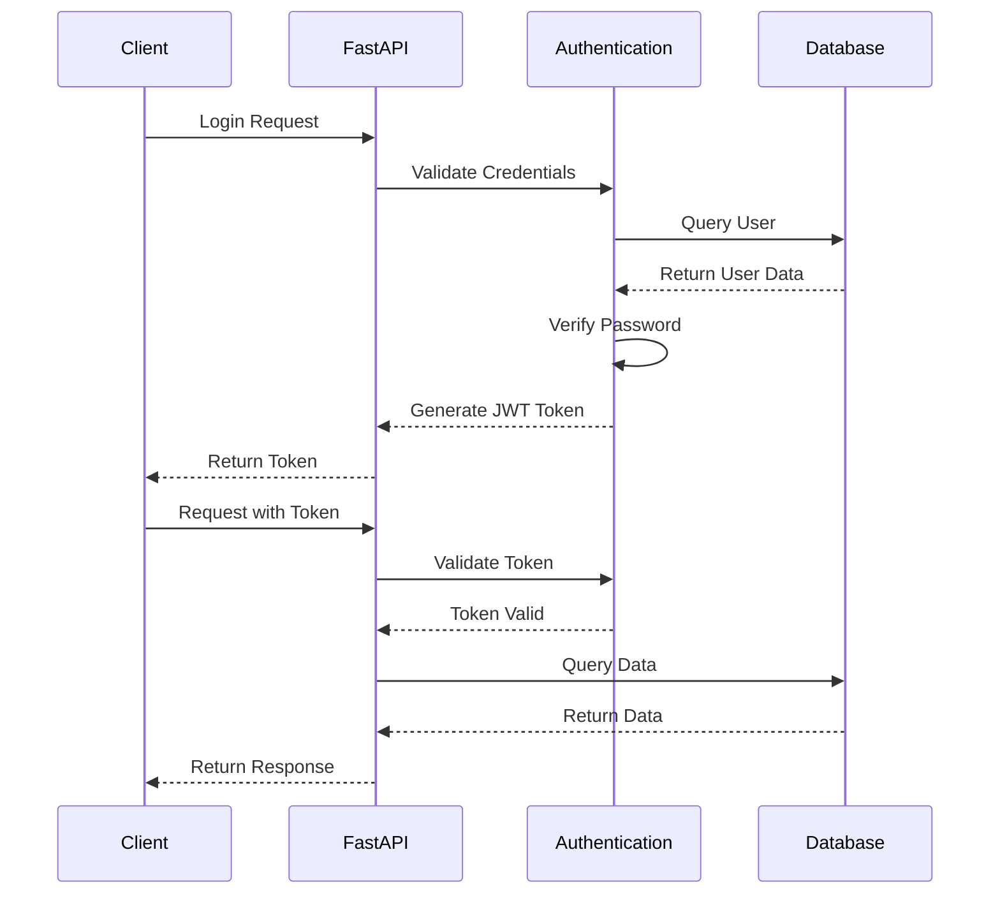

# Autenticação e Segurança

## Visão Geral

O sistema de autenticação e segurança do Qontrola utiliza tokens JWT (JSON Web Tokens) em conjunto com a arquitetura multi-tenant para garantir o acesso seguro aos recursos da API e o isolamento adequado dos dados entre diferentes tenants.

## Autenticação com JWT



### Processo de Autenticação

1. O cliente envia credenciais (email/senha) para o endpoint `/token`
2. O sistema verifica as credenciais contra o banco de dados
3. Se válidas, um token JWT é gerado com:
   - Identificador do usuário
   - Identificador do tenant
   - Permissões do usuário
   - Data de expiração
4. O token é enviado ao cliente
5. Nas requisições subsequentes, o cliente envia o token no cabeçalho `Authorization`

### Estrutura do Token JWT

```json
{
  "sub": "user-email@example.com",
  "tenant_id": "uuid-do-tenant",
  "tenant_domain": "domain-do-tenant",
  "is_superuser": false,
  "exp": 1673913600
}
```

## Validação de Token e Acesso

```python
async def get_current_user(
    tenant: Tenant = Depends(get_current_tenant),
    token: str = Depends(oauth2_scheme),
    db: AsyncSession = Depends(get_db)
):
    credentials_exception = HTTPException(
        status_code=status.HTTP_401_UNAUTHORIZED,
        detail="Could not validate credentials",
        headers={"WWW-Authenticate": "Bearer"},
    )
    
    try:
        payload = jwt.decode(
            token, settings.SECRET_KEY, algorithms=[settings.ALGORITHM]
        )
        email: str = payload.get("sub")
        if email is None:
            raise credentials_exception
        token_data = TokenData(email=email)
    except JWTError:
        raise credentials_exception
        
    # Verifica se o token pertence ao tenant correto
    if str(payload.get("tenant_id")) != str(tenant.id):
        raise credentials_exception
        
    user = await db.execute(
        select(User)
        .where(User.email == token_data.email)
        .where(User.tenant_id == tenant.id)
    )
    user = user.scalar_one_or_none()
    
    if user is None:
        raise credentials_exception
    return user
```

## Controle de Acesso Baseado em Funções (RBAC)

O sistema implementa um controle de acesso baseado em funções para determinar quais usuários podem acessar quais recursos.

### Tipos de Usuários

1. **Superusuários do Sistema**: Acesso a operações de gerenciamento de tenants
2. **Superusuários do Tenant**: Acesso administrativo dentro de um tenant específico
3. **Usuários Regulares**: Acesso limitado dentro de um tenant específico

### Verificação de Permissões

```python
async def get_current_active_superuser(
    current_user: User = Depends(get_current_active_user),
) -> User:
    if not current_user.is_superuser:
        raise HTTPException(
            status_code=status.HTTP_403_FORBIDDEN,
            detail="The user doesn't have enough privileges",
        )
    return current_user
```

## Isolamento de Dados Multi-tenant

Todas as operações de dados são filtradas pelo tenant_id do usuário autenticado:

```python
async def get_items(
    tenant: Tenant = Depends(get_current_tenant),
    current_user: User = Depends(get_current_active_user),
    db: AsyncSession = Depends(get_db),
    include_inactive: bool = False,
):
    query = select(Item).where(Item.tenant_id == tenant.id)
    
    if not include_inactive:
        query = query.where(Item.is_active == True)
        
    result = await db.execute(query)
    items = result.scalars().all()
    return items
```

## Práticas de Segurança Adicionais

### 1. Armazenamento de Senhas

As senhas são armazenadas usando hashing seguro:

```python
def get_password_hash(password: str) -> str:
    return pwd_context.hash(password)

def verify_password(plain_password: str, hashed_password: str) -> bool:
    return pwd_context.verify(plain_password, hashed_password)
```

### 2. Proteção CORS

A API utiliza proteção CORS (Cross-Origin Resource Sharing) para limitar quais domínios podem acessar a API:

```python
app.add_middleware(
    CORSMiddleware,
    allow_origins=[
        'http://localhost:3000',
        'http://localhost:8080',
        'http://localhost:5173',
        # Outros domínios permitidos
    ],
    allow_credentials=True,
    allow_methods=["*"],
    allow_headers=["*"],
)
```

### 3. Validação de Dados

Todos os dados de entrada são validados usando modelos Pydantic, garantindo que apenas dados válidos sejam processados:

```python
class UserCreate(BaseModel):
    email: EmailStr
    password: str
    full_name: Optional[str] = None
    is_superuser: bool = False
    
    @validator('password')
    def password_strength(cls, v):
        if len(v) < 8:
            raise ValueError('Password must be at least 8 characters')
        # Outras validações de senha
        return v
```

### 4. Proteção Contra Injeção SQL

O uso do SQLAlchemy ORM protege automaticamente contra ataques de injeção SQL.

### 5. Renovação de Tokens

O sistema permite renovação de tokens antes da expiração, evitando desconexões desnecessárias.

## Considerações de Segurança em Produção

1. **HTTPS**: Utilizar sempre HTTPS em ambientes de produção
2. **Rate Limiting**: Implementar limitação de taxa para evitar ataques de força bruta
3. **Monitoramento**: Monitorar tentativas de autenticação falhas para detectar possíveis ataques
4. **Audit Logs**: Manter logs de auditoria para operações sensíveis
5. **Atualizações Regulares**: Manter as dependências atualizadas para evitar vulnerabilidades conhecidas

Para mais detalhes sobre a implementação técnica, consulte a [Arquitetura do Backend](backend_architecture.md) e a [Referência da API](api_reference.md). 