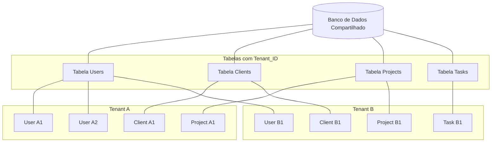
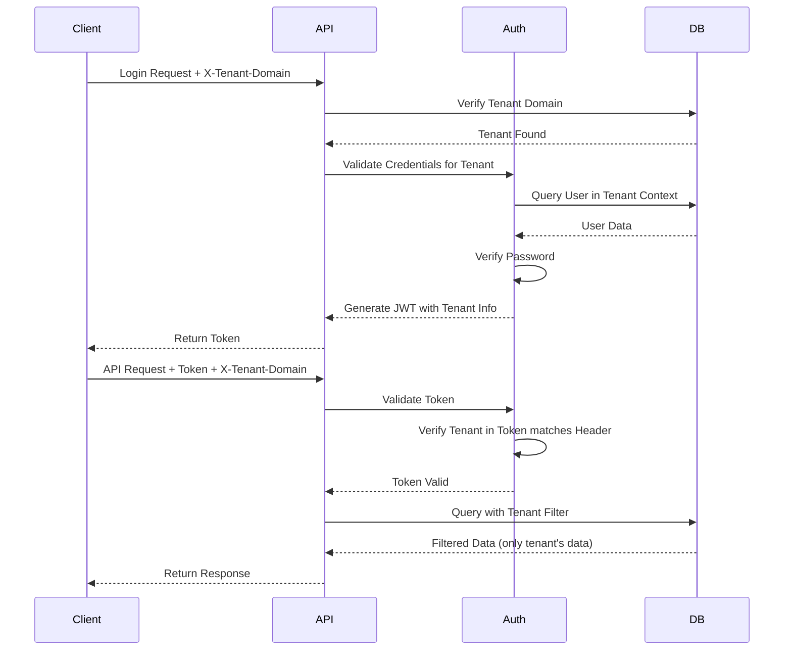

# Arquitetura Multi-tenant

## Visão Geral

O Qontrola utiliza uma arquitetura multi-tenant (multi-inquilino) com abordagem de banco de dados compartilhado. Esta arquitetura permite que várias organizações (tenants) utilizem a mesma instância da aplicação, enquanto mantém seus dados completamente isolados.

## Características da Implementação

### Modelo de Banco de Dados Compartilhado

Todas as organizações compartilham o mesmo banco de dados e esquema, mas cada registro pertence a um tenant específico.



### Isolamento de Dados

Cada tabela principal no banco de dados possui um campo `tenant_id` que associa o registro a um tenant específico:

```
class User:
    tenant_id: Mapped[uuid.UUID] = mapped_column(UUID(as_uuid=True), ForeignKey('tenants.id'), nullable=False)
    # outros campos
```

Todas as consultas de banco de dados incluem automaticamente um filtro por `tenant_id`, garantindo que um tenant não possa acessar dados de outro tenant.

### Mecanismo de Filtro Automático

As consultas são filtradas automaticamente por tenant usando dependências do FastAPI:

```python
async def get_current_tenant(
    x_tenant_domain: str = Header(...),
    db: AsyncSession = Depends(get_db)
):
    tenant = await db.execute(
        select(Tenant).where(Tenant.domain == x_tenant_domain)
    )
    tenant = tenant.scalar_one_or_none()
    if not tenant:
        raise HTTPException(
            status_code=status.HTTP_404_NOT_FOUND,
            detail="Tenant not found"
        )
    return tenant

async def get_current_active_user(
    tenant: Tenant = Depends(get_current_tenant),
    token: str = Depends(oauth2_scheme),
    db: AsyncSession = Depends(get_db)
):
    # Validação do token e obtenção do usuário
    # ...
    return user
```

Todas as operações de banco de dados são realizadas no contexto de um tenant específico, utilizando o `tenant_id` obtido através do cabeçalho `X-Tenant-Domain`.

## Processo de Autenticação Multi-tenant

1. O cliente fornece o domínio do tenant no cabeçalho `X-Tenant-Domain`
2. O sistema valida o domínio e identifica o tenant correspondente
3. O login é validado no contexto desse tenant específico
4. O token JWT gerado inclui informações sobre o tenant
5. Todas as requisições subsequentes incluem o token JWT e o cabeçalho `X-Tenant-Domain`



## Vantagens da Arquitetura Multi-tenant

1. **Eficiência de Recursos**: Uma única instância da aplicação atende a múltiplos tenants
2. **Facilidade de Manutenção**: Atualizações e correções são aplicadas simultaneamente para todos os tenants
3. **Escalabilidade**: Novos tenants podem ser adicionados sem necessidade de novas instalações
4. **Isolamento de Dados**: Cada tenant possui seus próprios dados isolados

## Considerações de Segurança

- Todas as consultas incluem filtros por tenant para garantir o isolamento de dados
- Tokens JWT incluem informações do tenant para validação adicional
- Headers de tenant são validados em cada requisição
- Senhas são armazenadas com hash seguro
- Migrações e atualizações de esquema são aplicadas com cuidado para preservar a integridade dos dados de todos os tenants

## Registro de Novos Tenants

Novos tenants podem se registrar através do endpoint `/tenants/register`, que:

1. Cria um novo registro de tenant
2. Configura um usuário administrador inicial
3. Aplica configurações padrão para o tenant

Para mais detalhes sobre a implementação técnica, consulte a [Arquitetura do Backend](backend_architecture.md) e a [Referência da API](api_reference.md). 